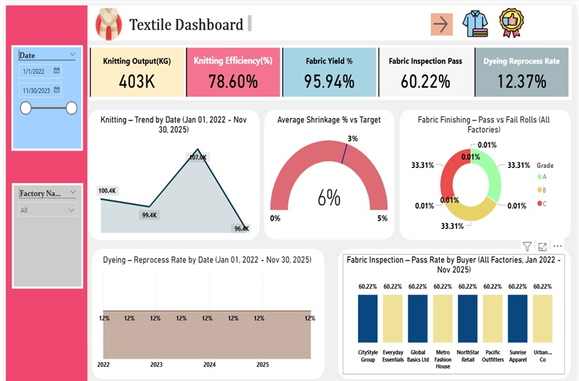
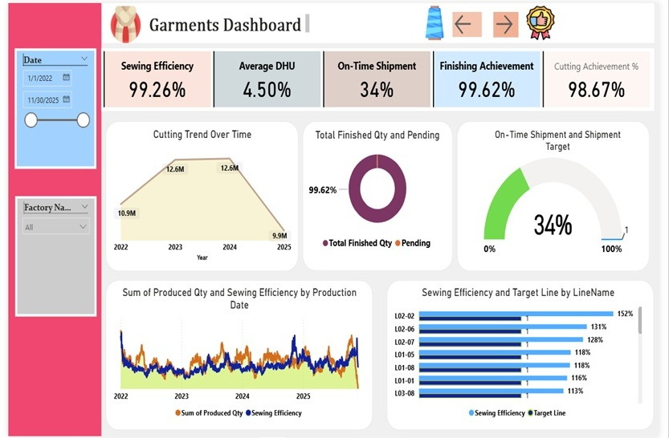

# rmg-production-analysis-dashboard
📊 RMG Production Analysis Dashboard (Power BI)

This project is a Power BI dashboard developed for analyzing end-to-end performance of a Ready-Made Garments (RMG) manufacturing operation, covering both Textile (Knitting, Dyeing, Finishing) and Garments (Cutting, Sewing, Finishing & Shipment) processes.

🧩 Dashboard Pages
   1️⃣ Textile Dashboard 

      Focus on knitting, dyeing and fabric quality performance.

   2️⃣ Garments Dashboard 
      Focus on production efficiency, defect control and shipment performance.

📌 Key Business Insights
🔹 Textile (Knitting, Dyeing & Finishing)

Total knitting output reached 403K KG, but overall efficiency is 78.6%, indicating scope for productivity improvement. 

insights

** Fabric inspection pass rate is only 60.22%, resulting in a high dyeing reprocess rate of 12.37%. 

** Average fabric shrinkage is 6%, which is above the target of 5%, showing weak finishing control. 

** All major buyers show the same inspection pass rate (60.22%), indicating that quality issues are systemic and internal, rather than buyer-specific. 

🔹 Garments (Cutting, Sewing, Finishing & Shipment)

 ** Sewing efficiency is extremely high at 99.26%, with several lines exceeding 152%, suggesting very high productivity but a possible need to review target settings. 

** Finishing achievement is 99.62%, meaning most orders are technically ready for dispatch. 

** Average DHU (Defects per Hundred Units) is 4.50%, which still offers scope for further cost and rework reduction. 

** Despite strong finishing performance, on-time shipment is only 34%, highlighting a major delivery and planning gap. 

** Cutting volume shows a declining trend from 12.6M (2023–24) to 9.9M (2025), which may indicate a potential slowdown in future orders. 

🛠 Tools & Technology

Microsoft Power BI Desktop

🎯 Project Objectives

Monitor production efficiency across textile and garments processes

Identify quality and reprocess bottlenecks

Track defect performance (DHU) and finishing readiness

Highlight shipment delays and operational planning gaps

Support management decision-making using interactive dashboards

⚠ Data Notice

This dashboard is created for portfolio and learning purposes.
Sensitive factory and buyer information should be anonymized before public sharing.

👤 Author

Aspiring Data Analyst
Power BI Portfolio Project – RMG Production & Operations Analysis
